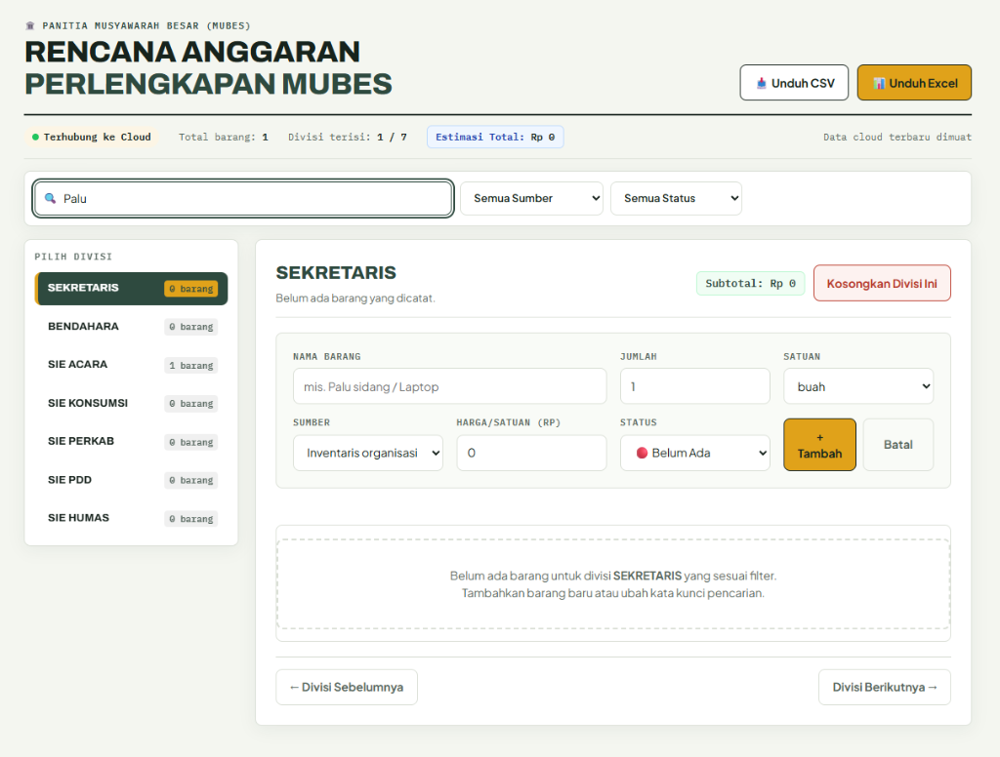

# 🏛️ Rencana Anggaran Perlengkapan MUBES

Aplikasi web interaktif dan kolaboratif untuk membantu Panitia Musyawarah Besar (MUBES) mencatat, mengelola, dan merekapitulasi kebutuhan perlengkapan serta rencana anggaran biaya per divisi secara real-time.



🌐 **Situs Live**: [https://emzyjeppp.github.io/form-perlengkapan-mubes/](https://emzyjeppp.github.io/form-perlengkapan-mubes/)

---

## ✨ Fitur Utama

- ☁️ **Sinkronisasi Cloud Real-Time**: Semua perubahan data otomatis tersimpan di cloud (Supabase REST API) sehingga seluruh panitia dapat berkolaborasi bersama dari perangkat masing-masing.
- 📱 **Mobile Friendly (No-Swipe Grid)**: Tampilan navigasi divisi berupa grid 2 kolom yang rapi pada HP, tanpa perlu menggeser/swipe layar.
- 💰 **Kalkulasi Rencana Anggaran Biaya**: Perhitungan harga otomatis per barang, subtotal per divisi, dan total estimasi anggaran MUBES keseluruhan dalam format Rupiah.
- 🚦 **Indikator Status Kesiapan**: Pantau progres kesiapan barang dengan badge status (🔴 Belum Ada, 🟡 Dalam Proses, 🟢 Sudah Siap).
- 🔍 **Pencarian Global & Filter**: Cari barang secara instan di seluruh divisi dan filter berdasarkan sumber (Inventaris, Beli, Sewa, Pinjam) atau status kesiapan.
- 📊 **Export Data Excel & CSV**: Unduh rekapitulasi data lengkap dengan satu klik dalam format `.xlsx` (SheetJS) atau `.csv`.

---

## 🏛️ Divisi Panitia

1. Sekretaris
2. Bendahara
3. Sie Acara
4. Sie Konsumsi
5. Sie Perkab
6. Sie PDD
7. Sie Humas

---

## 🛠️ Teknologi

- **Frontend**: Vanilla HTML5, CSS3, Modern JavaScript (ES6+)
- **Cloud Backend**: Supabase REST API & LocalStorage Fallback
- **Export Library**: SheetJS (XLSX)
- **Deployment**: GitHub Pages

---

## 🚀 Cara Penggunaan Lokal

1. Clone repositori ini:
   ```bash
   git clone https://github.com/Emzyjeppp/form-perlengkapan-mubes.git
   ```
2. Buka berkas `index.html` di peramban (browser) Anda.
